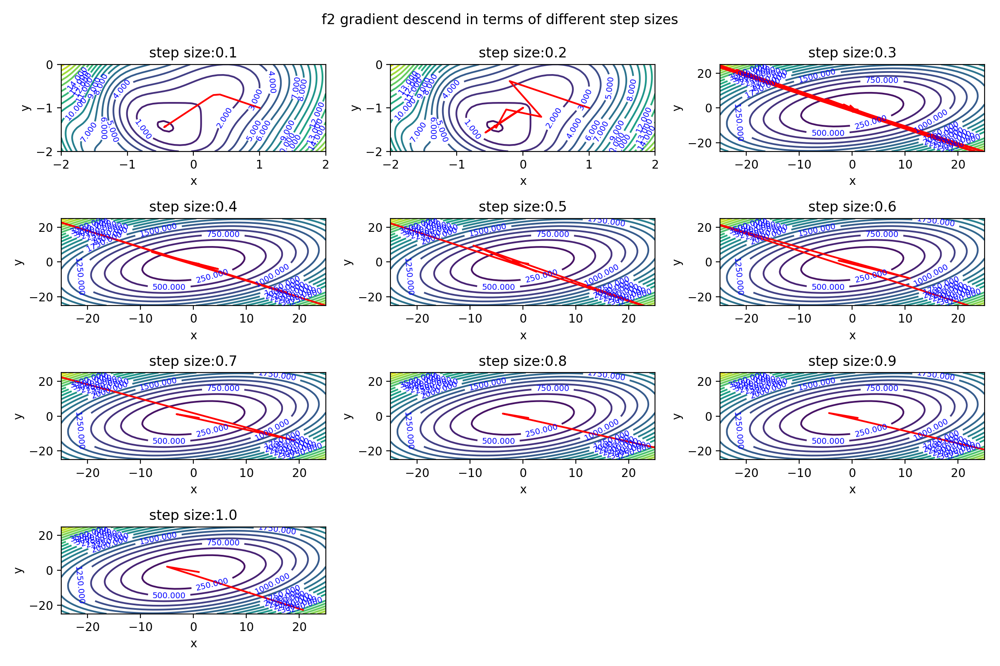
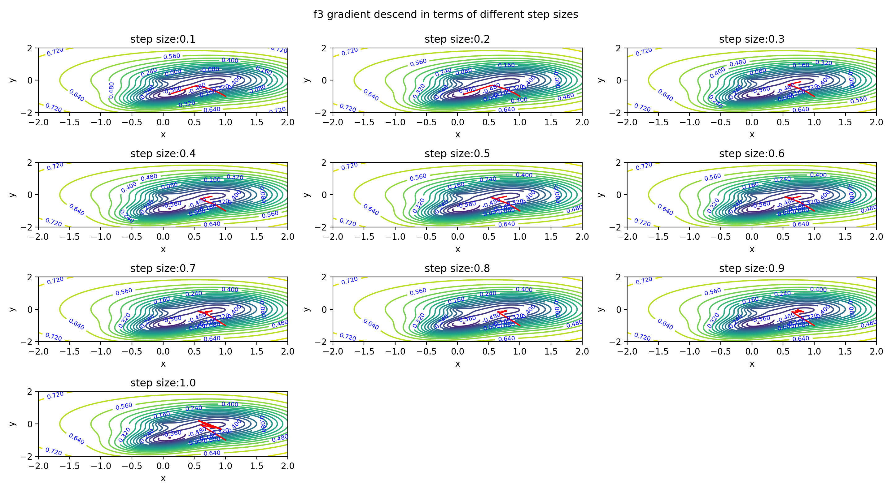
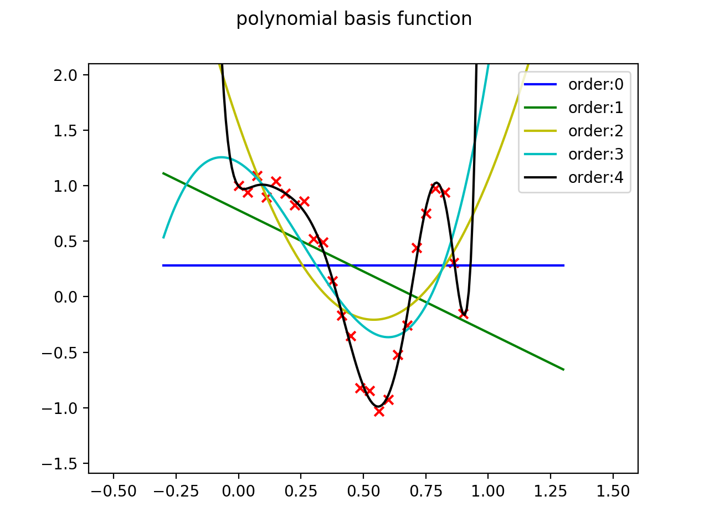

# CO496-Mathematics for Machine Learning

## gradient descent
- [gradient descend](GradientDescend/)

by using different stepsizes and to see how stepsize affect gradient descent , and discover the problem of  zig- zag and divergence corresponding to different stepsizes.

Comparison Result.
 
 
 
 
 ## Linear Regression
- [Linear Regression](LinearRegression/)

using the polynomial mapping , Trigonometric mapping, Gaussian mapping to do Linear Regression,and also when it comes to high-order polynomial function,we can find out the over-fitting problem,and use the l2 norm to penalize the high-weighted parameters to get a generalized model.

 
 
